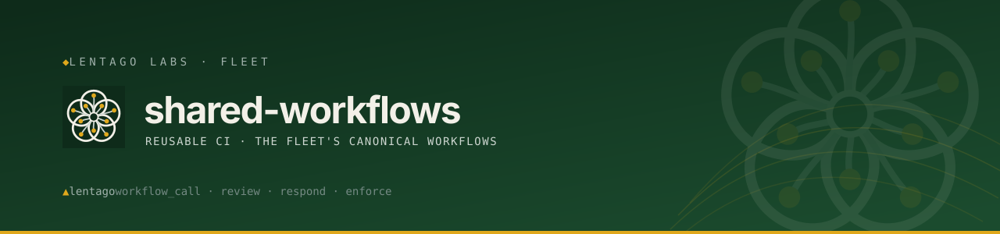

<!-- Lentago Labs brand header — generated by lentago/.github → brand/generate.py.
     Regenerate there; do not hand-edit the banner or badge URLs. -->
<a href="https://lentago.dev"></a>

[](https://github.com/lentago/shared-workflows/actions) [](https://github.com/lentago/shared-workflows/blob/main/LICENSE) [](https://deepwiki.com/lentago/shared-workflows)

  

# shared-workflows

Reusable GitHub Actions workflows for Lentago Labs repositories.

**Authorship:** The workflows and documentation in this repo are co-written with [Claude](https://claude.ai) (Anthropic). I direct the work and review the output; Claude writes the YAML. I'm an infrastructure operator, not a software engineer — please don't read this repo as a portfolio of coding ability.

## Workflows

### `claude-responder.yml`

Interactive `@claude` responder. Routes to opus/sonnet/haiku based on
`model:opus` / `model:sonnet` / `model:haiku` labels on the issue or PR.

```yaml
name: Claude Code

on:
  issue_comment:
    types: [created]
  pull_request:
    types: [opened, synchronize, labeled]
  pull_request_review_comment:
    types: [created]
  pull_request_review:
    types: [submitted]
  issues:
    types: [opened, edited, labeled, assigned]

jobs:
  claude:
    uses: lentago/shared-workflows/.github/workflows/claude-responder.yml@main
    secrets: inherit
    with:
      allowed_tools: '"Bash(git add:*)" "Bash(git commit:*)" "Read" "Edit" "Write"'
      # default_model: opus      # optional, default "sonnet"
      # max_turns: 25             # optional
      # extra_args: |             # optional, e.g. --verbose
      #   --verbose
      #   --output-format stream-json
```

### `claude-review.yml`

Automated PR review pinned to Haiku. Caller passes a focus block describing
the repo and what to look for; the reusable workflow wraps it with the common
PR-context header, rules, and output-format scaffolding.

The review is **advisory and non-blocking**: the review step runs
`continue-on-error` and the job always exits `0`, so a transient API failure
or turn-budget exhaustion never reds the check or blocks auto-merge — if the
review can't complete, a neutral soft-fail comment is posted instead. Optional
inputs: `model` (default `haiku`), `max_turns` (default `40`, set high enough
that a normal review finishes before the cap), `allowed_bots` (default `"*"`).

```yaml
name: Claude Code Review

on:
  pull_request:
    types: [opened, synchronize, ready_for_review, reopened]
    paths-ignore:
      - "*.md"
      - "docs/**"
      - "LICENSE"
      - ".gitignore"

jobs:
  claude-review:
    uses: lentago/shared-workflows/.github/workflows/claude-review.yml@main
    secrets: inherit
    with:
      review_prompt: |
        This repository is X. Focus your review on:

        1. **Foo** — ...
        2. **Bar** — ...
```

### `shellcheck.yml`

ShellCheck for bash scripts. Pass an explicit `scripts` list, or leave it
empty for repo-wide `find -name '*.sh'` discovery.

```yaml
name: ShellCheck

on:
  pull_request:
    types: [opened, synchronize, ready_for_review, reopened]

jobs:
  shellcheck:
    uses: lentago/shared-workflows/.github/workflows/shellcheck.yml@main
    with:
      scripts: |
        deploy.sh
        scripts/start.sh
      # severity: warning  # optional, default "warning"
```

## Versioning

Callers reference `@main` for the floating tip. Tag stable versions
(`v0.1.0`, `v1`) once contracts solidify and migrate callers to the tag.
